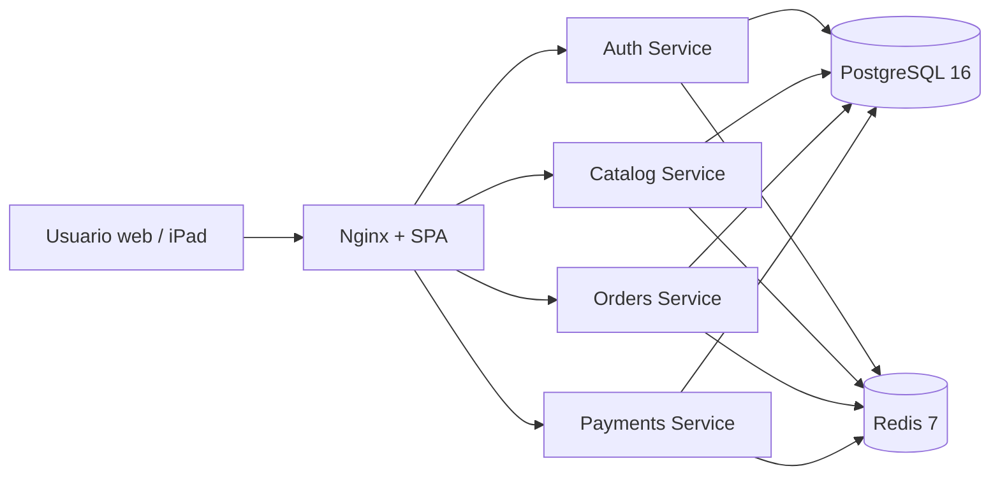

# Arquitectura de la solución

## Decisiones

La aplicación adopta microservicios a nivel de despliegue y dominio, pero conserva **una sola instancia PostgreSQL y el esquema `duality`** para respetar el modelo relacional aprobado durante el seminario. Es una decisión pragmática para una clínica pequeña y un proyecto académico. Si la solución crece, cada servicio puede migrar sus tablas a bases separadas y comunicarse por eventos.

### Auth
Gestiona identidad, usuarios, roles y emisión/revocación de JWT. Redis conserva la lista de `jti` revocados hasta la expiración del token.

### Catálogo
Agrupa pacientes, productos, servicios, inventario y ejecución de servicios clínicos. El inventario no guarda un `stock_actual` editable: se deriva del libro de movimientos y se valida transaccionalmente.

### Pedidos
Gestiona ventas y sus detalles. Una venta se confirma únicamente cuando cumple las reglas de pago y stock.

### Pagos
Registra pagos, métodos y estado de cuenta. Al completar el monto de una venta puede invocar la confirmación transaccional, que descuenta inventario.

## Concurrencia de inventario

PostgreSQL bloquea la fila de `producto` con `SELECT ... FOR UPDATE` antes de calcular el stock de un movimiento. Esto serializa operaciones concurrentes sobre el mismo producto. Los movimientos son inmutables; una corrección se registra como ajuste compensatorio.

## Seguridad

- Tokens JWT firmados y expirables.
- Revocación en Redis al cerrar sesión.
- Roles y mínimo privilegio a nivel de API.
- Restricciones, claves y triggers en la base de datos como segunda barrera.
- Nginx centraliza el acceso web; en producción debe terminar TLS.
